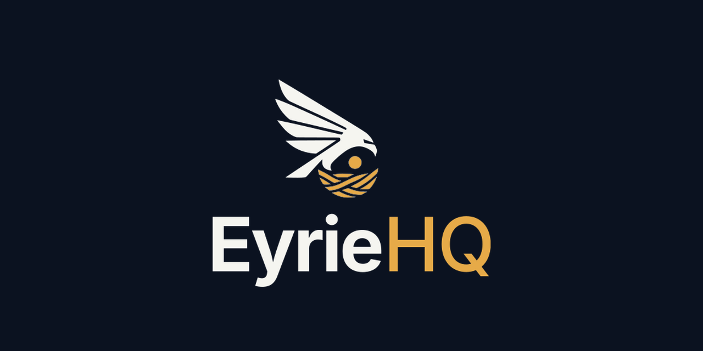

  

<h3 align="center">Open-source infrastructure intelligence — monitoring, observability, and JIT access control for AWS</h3>

  <a href="https://eyriehq.com">Website</a> ·
  <a href="https://eyriehq.com/features">Features</a> ·
  <a href="https://eyriehq.com/blog">Blog</a> ·
  <a href="https://eyriehq.com/docs">Docs</a>

---

EyrieHQ is a self-hosted infrastructure intelligence platform for AWS — built for DevOps engineers, SREs, and platform teams who want full visibility and **zero standing access**.

- **Real-time AWS monitoring** across EC2, EKS, RDS, ElastiCache, DocumentDB, and more
- **Full-stack observability** — logs, metrics, and traces via an OpenTelemetry-native agent
- **JIT access control** — request-approval workflows with auto-expiring STS credentials
- **Plugin architecture** — 15+ plugins, open SDK, extensible by design

No vendor lock-in. No per-host pricing. AGPLv3 — self-host it, own your data.

### Key repos

| Repo | Description |
|------|-------------|
| [eyriehq/eyriehq](https://github.com/eyriehq/eyriehq) | Core platform — FastAPI backend, React frontend |
| [eyriehq/plugins](https://github.com/eyriehq/plugins) | Plugins Repository |
| [eyriehq/helm-charts](https://github.com/eyriehq/helm-charts) | Helm charts for Kubernetes deployments |

  <a href="https://www.linkedin.com/company/eyriehq">LinkedIn</a> ·
  <a href="https://eyriehq.com/blog">Blog</a>

